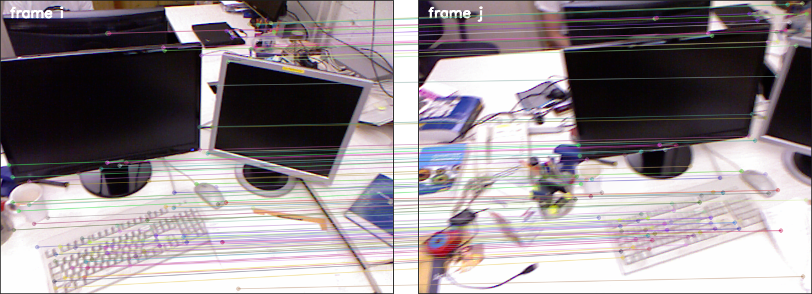
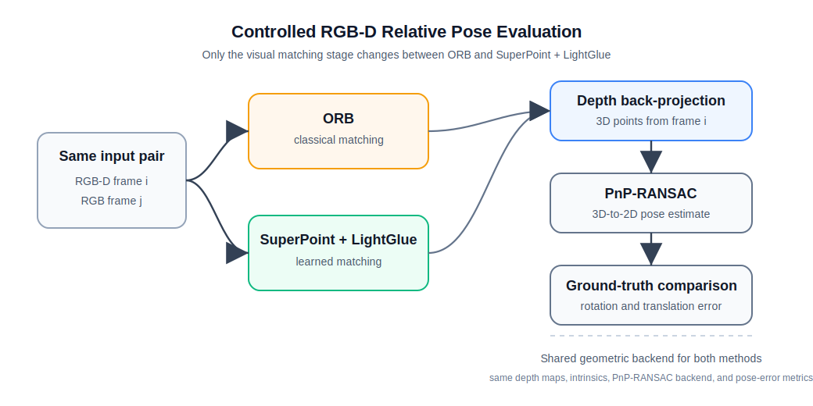
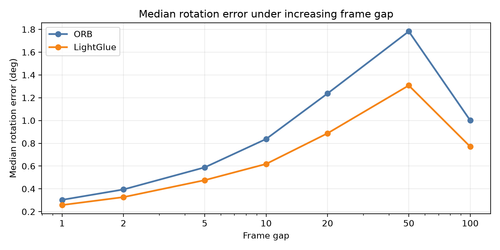
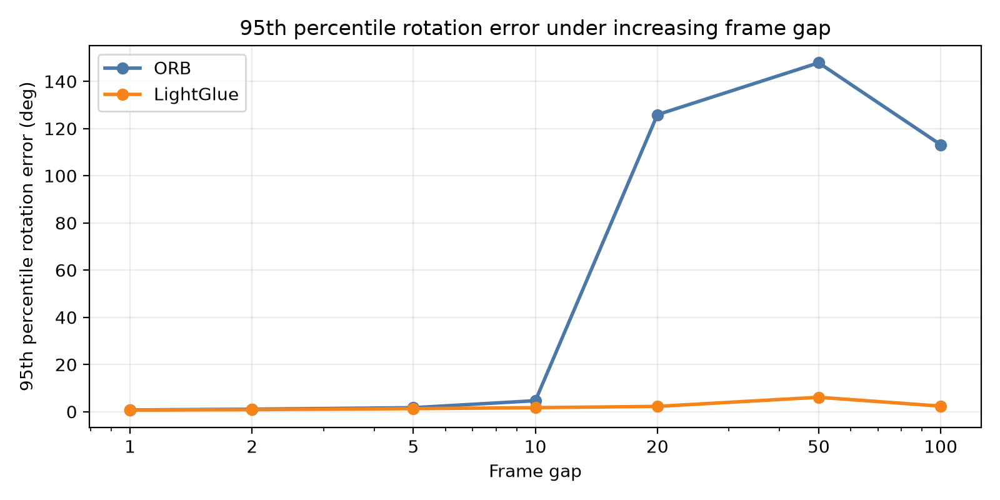
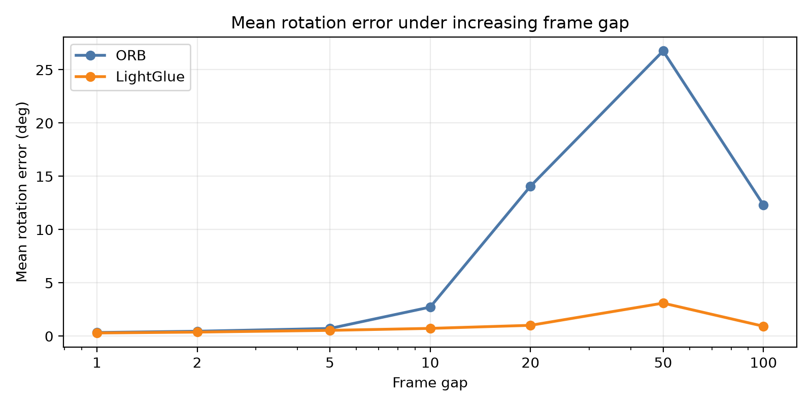
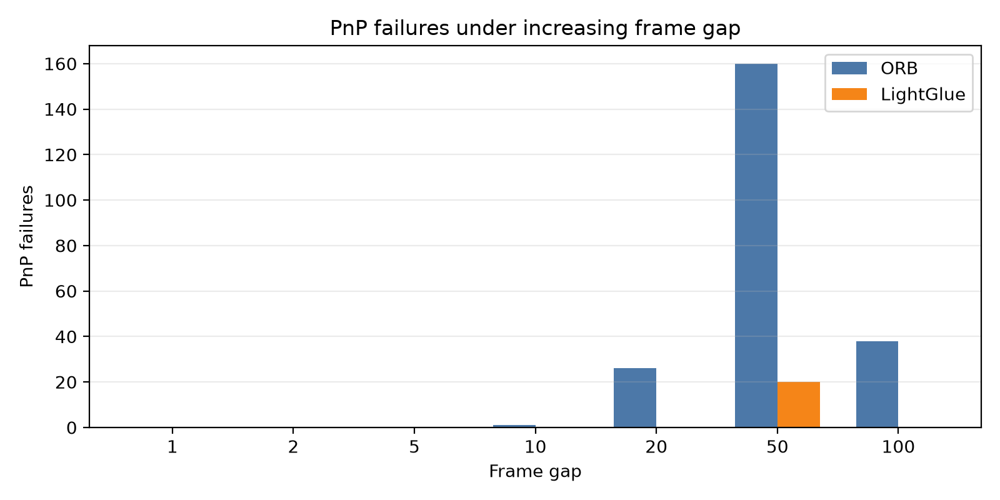
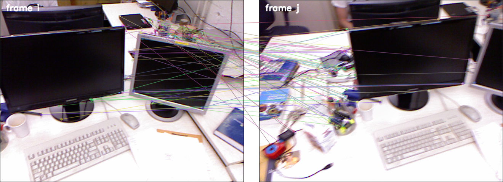
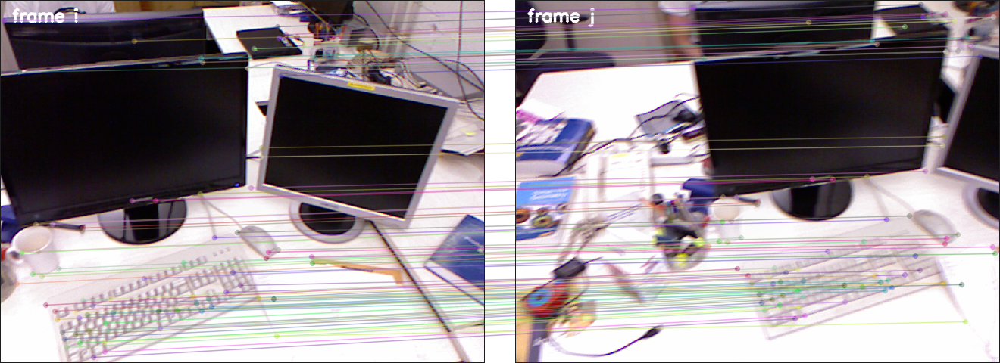

# RGB-D Relative Pose: ORB vs SuperPoint + LightGlue

This project compares classical and learned feature matching methods for estimating camera motion from RGB-D image pairs. It uses ORB as a classical baseline and SuperPoint + LightGlue as a learned matching pipeline, with the goal of studying how both methods behave when the motion between frames increases.



*Matched points between two RGB frames. These 2D correspondences are later combined with depth from the first frame to estimate the relative camera pose.*

## Goal

Estimating the motion of a camera between two observations is a common geometric task in computer vision and robotics. This project studies that problem using RGB-D data, where each frame contains both a color image and a depth image.

The color image shows what the camera sees. The depth image gives the distance from the camera to the visible surfaces.

The goal is to estimate how the camera moved from the first frame to the second. In geometric vision, this is called estimating the relative pose between the two frames, which contains the rotation and translation of the camera.

To estimate this motion, the system first needs to find visual correspondences between the two color images. A correspondence means that a point seen in the first image is matched with the same physical point in the second image.

This project compares ORB, a hand-designed feature method, with SuperPoint + LightGlue, a learned matching pipeline. The question is whether the learned matcher produces correspondences that remain useful when the motion between frames increases.

## Evaluation Method

Both matchers are evaluated inside the same RGB-D relative pose pipeline. For each pair, the matcher produces 2D correspondences between the RGB images. The depth map from the first frame converts the matched pixels in frame `i` into 3D points. These 3D points are paired with their matched 2D locations in frame `j`, and PnP-RANSAC, the geometric pose-estimation step, estimates the relative pose from frame `i` to frame `j`.



The experiment varies the temporal gap between paired frames. A small gap corresponds to a small camera motion, while a larger gap usually creates a harder matching and pose-estimation problem.

For each frame gap, ORB and SuperPoint + LightGlue are evaluated on the same frame pairs, depth maps, camera intrinsics, PnP-RANSAC backend, and pose-error metrics. This keeps the comparison focused on which method produces correspondences that remain useful for camera motion estimation as the frame gap increases.

## Results

The current evaluation uses the full `freiburg1_xyz` sequence.

The main observation is that SuperPoint + LightGlue is not much more accurate than ORB on easy pairs, but it is much more robust when the frame gap increases.

The plots below summarize rotation error and PnP failures across all evaluated frame pairs.

For small frame gaps, both methods estimate the relative pose accurately. At larger gaps, ORB often still has a low median error.



However, some ORB pairs produce very large rotation errors, visible through the sharp increase in the 95th percentile error. SuperPoint + LightGlue keeps this 95th percentile below 7° on all tested gaps, while ORB exceeds 100° at gaps 20, 50, and 100.



Gap 50 is harder than gap 100 on this sequence because the actual ground-truth motion is larger on average at gap 50. In other words, the frame gap controls how far apart the frames are in time, but the camera motion also depends on what happens in that part of the trajectory.

The mean rotation error shows that these catastrophic ORB estimates are not negligible and have a visible impact on average performance once the frame gap increases.



The PnP failure counts show the same trend from another angle. ORB fails to produce a pose on many large-gap pairs, especially at gap 50, while SuperPoint + LightGlue fails much less often.



This only counts pairs where PnP returned no pose at all, even though some pairs where PnP does return a pose are still unusable because their rotation error is extremely large. We keep these cases separate to avoid choosing an arbitrary angle threshold for marking a returned pose as failed.

The example below shows one of these large-gap failure cases. ORB returns a pose with a 179.90° rotation error, while SuperPoint + LightGlue estimates the same pair with a 0.47° rotation error.



*ORB matches on a difficult gap-20 pair. The estimated pose has a 179.90° rotation error.*



*SuperPoint + LightGlue matches for that pair. The estimated pose has a 0.47° rotation error.*

Visually, ORB produces many matches in cluttered regions of the desk, and several correspondences appear to connect different parts of the scene rather than stable physical points. In contrast, SuperPoint + LightGlue produces clearer matches on structured objects that are visible in both views, such as the monitors and the keyboard. The keyboard is especially visible because LightGlue finds many consistent matches there, while ORB finds none.

This robustness comes with a significant runtime cost. In the run used for the timing measurements, measured on a MacBook Air with M4 chip using PyTorch MPS, ORB extraction and matching took about 5.5 seconds in total, while SuperPoint extraction took about 55 seconds and LightGlue matching alone took about 59 minutes. Across the 5,398 evaluated pairs, this corresponds to about 1 ms per pair for ORB extraction and matching, compared with about 0.67 s per pair for SuperPoint extraction and LightGlue matching. This makes SuperPoint + LightGlue much more robust on this sequence, but also far more expensive to run.

The current results are limited to the `freiburg1_xyz` sequence. Additional TUM RGB-D sequences should be evaluated next to check whether the same trend holds under different camera motions and scene structures.

## Reproducing the results

Download the TUM RGB-D `freiburg1_xyz` sequence from the [official dataset page](https://cvg.cit.tum.de/data/datasets/rgbd-dataset/download) and place it under `data/rgbd_dataset_freiburg1_xyz/`.

Create the Python environment and install the dependencies:

```bash
python3 -m venv .venv
.venv/bin/python -m pip install -r requirements.txt
```

Run the full comparison:

```bash
make run-comparison
```

This evaluates ORB and SuperPoint + LightGlue on the frame gaps, estimates the relative poses, and writes a new timestamped folder under `outputs/`.

Analyze an existing run:

```bash
make analyze OUTPUT_DIR=outputs/comparison_2026-06-18_12-48-30
```

This reads the raw pair-level results, computes the summary metrics, and regenerates the plots used in the README.
